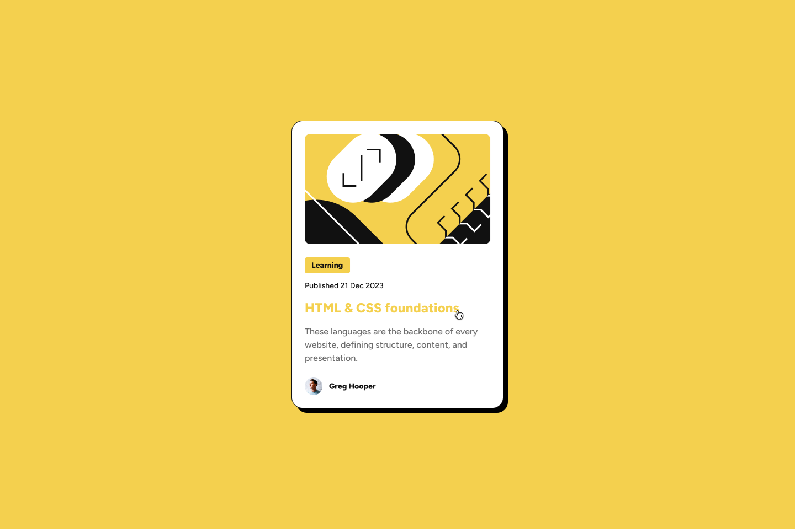
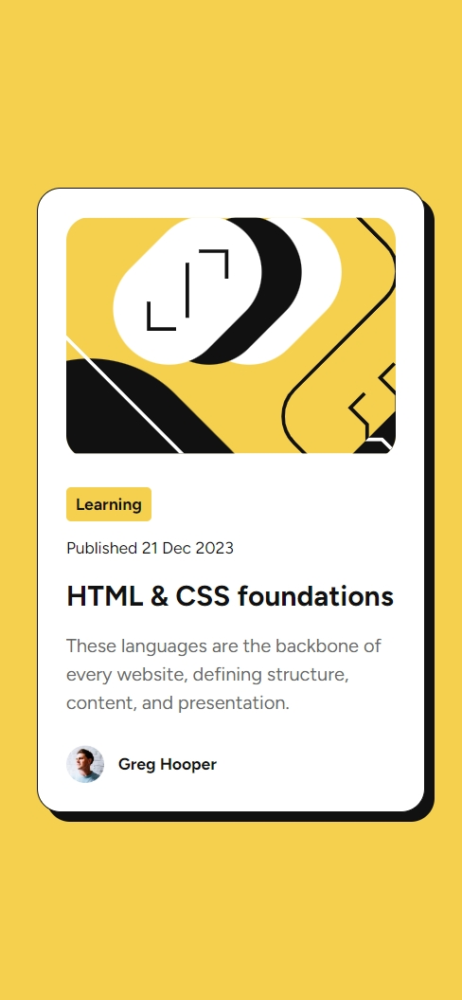
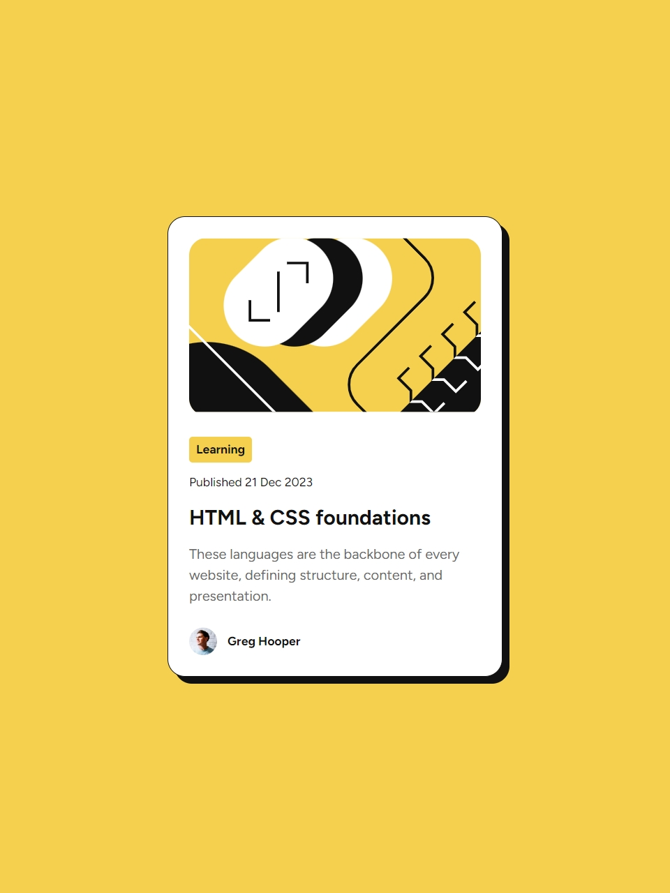
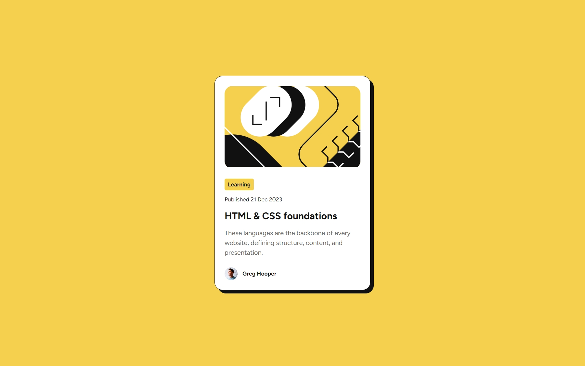

# Frontend Mentor - Blog preview card solution

This is a solution to the [Blog preview card challenge on Frontend Mentor](https://www.frontendmentor.io/challenges/blog-preview-card-ckPaj01IcS). Frontend Mentor challenges help you improve your coding skills by building realistic projects. 

## Table of contents

- [Overview](#overview)
  - [The challenge](#the-challenge)
  - [Screenshot](#screenshot)
- [My process](#my-process)
  - [Built with](#built-with)
  - [Useful resources](#useful-resources)
- [Author](#author)

## Overview

### The challenge

Users should be able to:

- See hover and focus states for all interactive elements on the page

When not hover:\

When hover:\

### Screenshot

On iphone12 pro (390x844)\

On ipad (768x1024)\

On macbook pro (1440x900)\

## My process

### Built with

- Semantic HTML5 markup
- CSS custom properties follow figma (font preset, theme colors)
- Flexbox
- Justify component
- Add hover
- Add responsive

### Useful resources

- [Responsively](https://responsively.app/) — Responsive browser for web developer

## Author

- Frontend Mentor - [@phurin-git](https://www.frontendmentor.io/profile/phurin-git)
